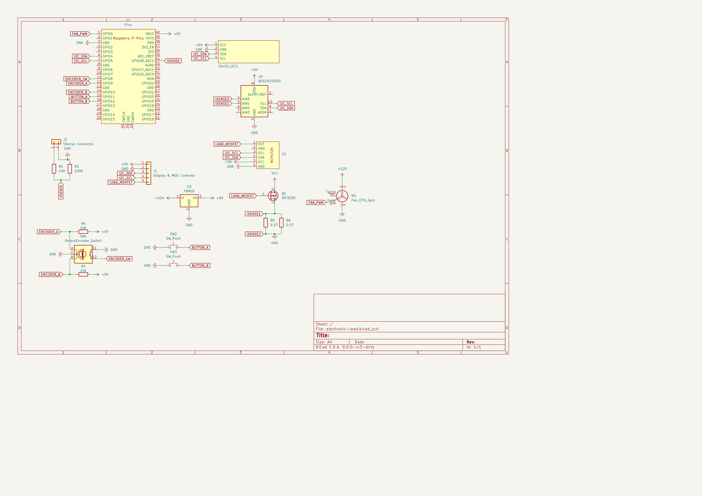

# ElectronicLoadPico
This is a project for creating a electronic load with a Raspberry Pi Pico as the main controller, this projects uses basically the same components as in [electronoobs version](https://electronoobs.com/eng_arduino_tut123.php) on arduino, however it has a new UI and code written in C that are completly new, the schematics are the following:

